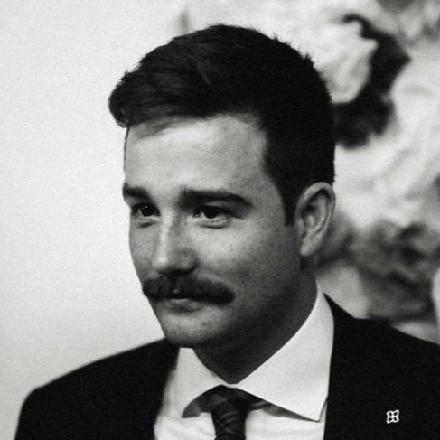

## Welcome!
I am a PhD researcher in Remote Sensing based at the University of Valencia co-hosted by the European Space Agency and the University of Leipzig under the ELLIS Programme. My interests are based around the terrestrial biosphere and the interaction with climate and anthropagentic activities. This page follows my research into terrestrial ecosystems, the methods and code that I use to analyse them. Supporter of Open Science.
 
 
# Current Research Projects
> ### Characterising Persistance in European Vegetation
> ### Non-Linear Memory Estimation
> ### XtremeExplorer - Open Source Explainable AI Toolbox to Detection and Atrribute Extreme Events
> ### Detecting Charcoal Production in Mozambique

